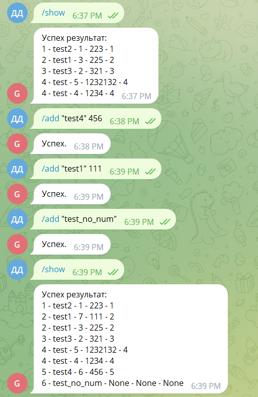

# Телеграм-бот - телефонный справочник 

## Список команд

- /start - Начало работы бота, вывод приветственного сообщения.
- /info <команда> - Вывод подробной информации о команде.
- /help - Вывод списка команд.

- /symbols - Пояснение специальных символов (<>...)

- /add <"имя контакта"> \*номер телефона\* - Добавление нового контакта в базу данных.  
Можно использовать без номера телефона.  
Кавычки вокруг имени контакта обязательны.

- /remove <contact/phone> <запись> - Удаление из базы данных контакта со всеми, 
привязанными к нему номерами телефонов (если за /remove следует contact) 
или номера телефона (если за /remove следует phone).

- /update <contact/phone> <старое значение> <новое значение> - Замена в базе данных значения на другое. 
Если заменяются контакты, то и старое и новое значение необходимо взять в кавычки.

- /search <contact/phone> - Поиск в базе данных контакта по номеру телефона (если за /search следует contact) 
или всех телефонов привязанных к контакту (если за /search следует phone).

- /show \*contact/phone\* - Вывод содержания базы данных. Если указать contact будет выведен список контактов без номеров 
телефона, если указать phone будет выведен список номеров телефона без контактов, если ничего не указывать, 
будет выведена вся информация.

- /export - Отправка .db файла, содержащего в себе базу данных.

